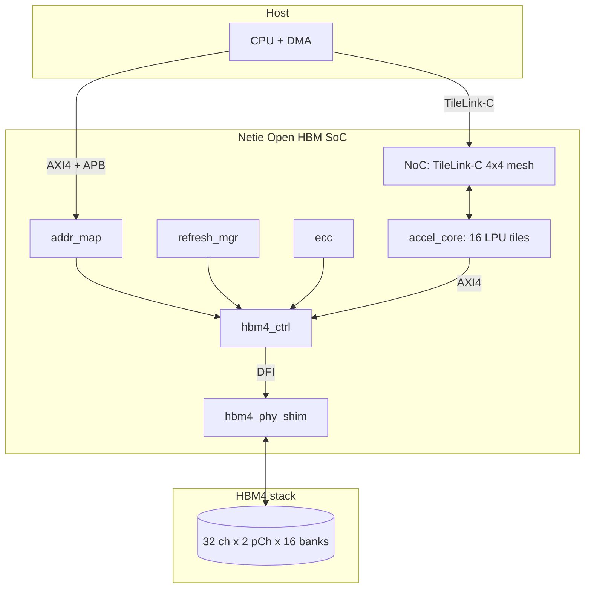

# Architecture overview

Netie Open HBM at one glance.

## Reading order

1. `Plan.md` -- the 36-month strategic plan.
2. `docs/arch/overview.md` -- this file.
3. `docs/spec/hbm4_timing.adoc` -- clean-room HBM4 timing summary.
4. `docs/agent-prompts/<ip>.md` -- per-IP agent prompts.
5. `hw/ip/<ip>/doc/<ip>.md` -- per-IP detail.

## Cross-cutting concerns

| Concern              | Where it lives                                    |
| -------------------- | ------------------------------------------------- |
| Style contract       | `CLAUDE.md`, `AGENTS.md`                          |
| Toolchain            | `flake.nix`, `.devcontainer/`, `pyproject.toml`   |
| CI                   | `.github/workflows/`                              |
| Verification harness | `tools/agent_eval/`                               |
| Open EDA flows       | `pd/sc_flows/`                                    |
| Custom cells         | `pd/cells/`                                       |
| Packaging screening  | `pkg/openems/`                                    |
| Export-control posture | `docs/legal/export_control.md`                  |
